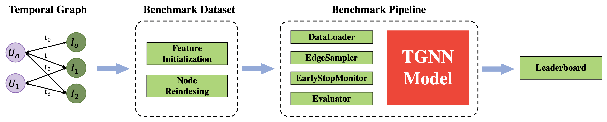
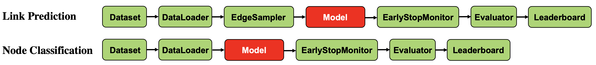
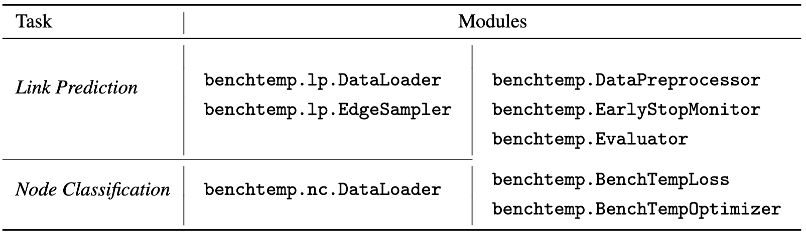

# BenchTemp: A General Benchmark for Evaluating Temporal Graph Neural Networks

[](https://opensource.org/licenses/MIT)
[](https://pypi.org/project/benchtemp/)


## Table of Contents
- [BenchTemp: A General Benchmark for Evaluating Temporal Graph Neural Networks](#benchtemp-a-general-benchmark-for-evaluating-temporal-graph-neural-networks)
  - [Table of Contents](#table-of-contents)
  - [Overview](#overview)
  - [BenchTemp Framework](#benchtemp-framework)
  - [BenchTemp Pipeline](#benchtemp-pipeline)
  - [BenchTemp Modules](#benchtemp-modules)
  - [Installation](#installation)
    - [Requirements](#requirements)
    - [PyPI install](#pypi-install)
  - [Package Usage](#package-usage)
    - [*DataPreprocessor*](#datapreprocessor)
    - [*TemporalGraph*](#temporalgraph)
    - [*lp.DataLoader*](#lpdataloader)
    - [*lp.RandEdgeSampler*](#lprandedgesampler)
    - [(2) Node Classification task](#2-node-classification-task)
    - [EarlyStopMonitor](#earlystopmonitor)
    - [Evaluator](#evaluator)
  - [Call for Contributions](#call-for-contributions)
---
## Overview
<br>

**BenchTemp** is a general Benchmark Python Library for evaluating Temporal Graph Neural Networks (TGNNs) quickly and efficiently on various workloads. 
**BenchTemp** provides **Benchmark Datasets**, and unified pipelines (**DataPreprocessor, DataLoader EdgeSampler, Evaluator, EarlyStopMonitor, BCELoss, Optimizer,and Leaderboard** ) for evaluating Temporal Graph Neural Networks on both link prediction task and node classification task.

- The BenchTemp PyPI Website is <a href="https://pypi.org/project/benchtemp/" target="_blank">Here</a>.

- The GitHub of BenchTemp project is <a href="https://github.com/qianghuangwhu/benchtemp" target="_blank">Here</a>. 

- The datasets are <a href="https://drive.google.com/drive/folders/1HKSFGEfxHDlHuQZ6nK4SLCEMFQIOtzpz?usp=sharing" target="_blank">Here</a>. 

- The leaderboards website for Temporal Graph Neural Networks on both Link Prediction and Node Classification tasks is <a href="https://my-website-6gnpiaym0891702b-1257259254.tcloudbaseapp.com/" target="_blank">Here</a>.
- The source codes for evaluating existing Temporal Graph Neural Networks based on BenchTemp are <a href="" target="_blank">coming soon</a>.

---

## BenchTemp Framework
<br>
<div align="center">

</div>

---

## BenchTemp Pipeline
<br>
<div align="center">

</div>

---

## BenchTemp Modules
<br>
<div align="center">

</div>

---


## Installation

### Requirements


Please ensure that you have installed the following dependencies:

- numpy >= 1.18.0
- pandas >= 1.2.0
- sklearn >= 0.20.0

### PyPI install

```bash
pip3 install benchtemp 
```

---
## Package Usage
---

### *DataPreprocessor*
<br>

The datasets that have been preprocessed by BenchTemp are [Here](https://drive.google.com/drive/folders/1HKSFGEfxHDlHuQZ6nK4SLCEMFQIOtzpz?usp=sharing).
You can directly download the datasets and then put them into the directory './data'.

In addition, BenchTemp provides *DataPreprocessor* class for you to preprocess yours TGNNs datasets. 
<!-- you can download the original datasets [Here]() and then  -->
<!-- use the functions provided by BenchTemp for data data. -->

*Class*:

**benchtemp.DataPreprocessor**(*data_path : str, data_name : str*)

*Args*:

- *data_name : str* - the path of the dataset.
- *data_name : str* - the name of the dataset.


*Function*:

**DataPreprocessor.data_preprocess**(*bipartite: bool*)

*Args*:

- *bipartite : bool* - Whether the Temporal Graph is bipartite graph.

*Returns*:

1. *ml_{data_name}.csv* - the csv file of the Temporal Graph.
This file have five columns with properties:
   - '*u*': the id of the user.
   - '*i*': the id of the item.
   - '*ts*': the timestamp of the interaction (edge) between the user and the item.
   - '*label*': the label of the interaction (edge).
   - '*idx*': the index of the interaction (edge).

1. *ml_{data_name}.npy* - the edge features corresponding to the interactions (edges) in the the Temporal Graph..


3. *ml_{data_name}_node.npy* - the initialization node features of the Temporal Graph.

Example:

```python
import benchtemp as bt

processor = bt.DataPreprocessor(data_path="./data/", data_name="mooc")
# If the dataset is bipartite graph, i.e. the user (source nodes) and the item (destination nodes) are of the same type.
processor.data_preprocess(bipartite=True)

# If the dataset is non-bipartite graph.
processor.data_preprocess(bipartite=False)
```

<!-- Notes:

For bipartite graph, BenchTemp will factorize the source node index and 
the destination node index, respectively. 
```python
import pandas as pd

assert len(sources) == len(destinations)

# bipartite graph
sources, _ = pd.factorize(sources)
destinations, _ = pd.factorize(destinations)

upper_u = sources.max + 1
destinations = destinations + upper_u
```
For non-bipartite graph, BenchTemp will factorize the concatenation of source node array and 
the destination node array. 

```python
import pandas as pd
import numpy as np

assert len(sources) == len(destinations)
interaction_num = len(sources)

# non-bipartite graph
node_index, _ = pd.factorize(np.concatenate((sources, destinations), axis=0))

sources = node_index[[0:interaction_num]]
destinations = node_index[[interaction_num:interaction_num + interaction_num]]
``` -->
---


### *TemporalGraph*
<br>

The class of a temporal graph. A temporal graph can  be represented as an ordered sequence of temporal user-item
interactions $I_{r}=(u_{r}, i_{r}, t_{r}, e_{r})$, $0 \leq t_{1} \leq  \dots  t_{r} \dots \leq  T$. The $r$-th interaction $I_{r}$ happens at time $t_{r}$ between user $u_{r}$ and item $i_{r}$
with edge feature $e_{r}$.

*Class*:

**TemporalGraph**(*sources : numpy.ndarray,
destinations : numpy.ndarray,
timestamps : numpy.ndarray,
edge_idxs : numpy.ndarray,
labels : numpy.ndarray*)

*Args*:
- *sources : numpy.ndarray* - Array of sources of Temporal Graph edges.
- *destinations : numpy.ndarray* - Array of destinations of Temporal Graph edges.
- *timestamps : numpy.ndarray* - Array of timestamps of Temporal Graph edges.
- *edge_idxs : numpy.ndarray* - Array of edge IDs of Temporal Graph edges.
- *labels : numpy.ndarray* - Array of labels of Temporal Graphe dges.

*Returns*: 
- *benchtemp.TemporalGraph*. A Temporal Graph.


Example:
```python
import pandas as pd
import numpy as np
import benchtemp as bt


graph_df = pd.read_csv("dataset_path")

sources = graph_df.u.values
destinations = graph_df.i.values
edge_idxs = graph_df.idx.values
labels = graph_df.label.values
timestamps = graph_df.ts.values

# For example, the full Temporal Graph of the dataset is full_data.
full_data = bt.TemporalGraph(sources, destinations, timestamps, edge_idxs, labels)
```

---

### *lp.DataLoader*

<br>

The DataLoader class for link prediction tasks. 

In *transductive link prediction*, Dataloader splits the temporal graphs chronologically into 70\%-15\%-15\% for train, validation and test sets according to edge timestamps. 

In *inductive link prediction*, Dataloader performs the same split as the transductive setting, and randomly masks 10\% nodes as unseen nodes.
Any edges associated with these unseen nodes are removed from the training set.
To reflect different inductive scenarios,
DataLoader further generates three inductive test sets from the transductive test dataset, by filtering edges in different manners:

  - **Inductive** -  selects edges with at least one unseen node. 
  - **Inductive New-Old** - selects edges between a seen node and an unseen node.
  - **Inductive New-New** - selects edges between two unseen nodes. 

*class*:

**lp.DataLoader**(*dataset_path: str, dataset_name: str, different_new_nodes_between_val_and_test: bool,
                 randomize_features: bool*)

*Args*:

- *dataset_path: str* - the path of the dataset.
- *dataset_name: str* - the name of dataset.
- *different_new_nodes_between_val_and_test: bool* - new nodes are between validation set and test set.
- *randomize_features: str* - random initialization of node features. 

*Function*:

**lp.DataLoader.load()**

Returns:
- *node_features : numpy.ndarray* - Array of the Node Features of the Temporal Graph. 
- *edge_features : numpy.ndarray* - Array of the Edge Features of the Temporal Graph.
- *full_data : benchtemp.TemporalGraph* - Full Temporal Graph dataset. 
- *train_data : benchtemp.TemporalGraph* - The training set. 
- *val_data : benchtemp.TemporalGraph* - The validation set.
- *test_data : benchtemp.TemporalGraph*  - The **Transductive** test set.
- *new_node_val_data : benchtemp.TemporalGraph* - The **Inductive**  validation set.
- *new_node_test_data : benchtemp.TemporalGraph* - The **Inductive**  test set.
- *new_old_node_val_data : benchtemp.TemporalGraph* - The **Inductive New-Old** validation set.
- *new_old_node_test_data : benchtemp.TemporalGraph* - The **Inductive New-Old**  test set.
- *new_new_node_val_data : benchtemp.TemporalGraph* - The **Inductive New-New** validation set.
- *new_new_node_test_data : benchtemp.TemporalGraph* - The **Inductive New-New** test set.
- *unseen_nodes_num : int* - The number of unseen nodes in inductive setting.

Example:

```python
import benchtemp as bt

data = bt.lp.DataLoader(dataset_path="./data/", dataset_name='mooc')

node_features, edge_features, full_data, train_data, val_data, test_data, new_node_val_data, new_node_test_data, new_old_node_val_data, new_old_node_test_data, new_new_node_val_data, new_new_node_test_data, unseen_nodes_num = data.load()
```

---

### *lp.RandEdgeSampler*

<br>

BenchTemp provides the unified
negative edge sampler with **a seed** for Link Prediction task to  sample an equal amount of negatives to the positive interactions.

Class:

**RandEdgeSampler(src_list : numpy.ndarray, dst_list : numpy.ndarray, seed : int =None)**

Args:
- **src_list : numpy.ndarray** - the list of source nodes.
- **dst_list : numpy.ndarray** - the list of destination nodes.
- **seed : numpy.ndarray** - seed of random.

Returns: 

- **benchtemp.RandEdgeSampler**

Example:

```python
import benchtemp as bt

# For example, if you are training , you should create a training  RandEdgeSampler based on the training dataset.
train_rand_sampler = bt.lp.RandEdgeSampler(train_data.sources, train_data.destinations)

...
for epoch in range(args.epochs):
    ...
    # sample an equal amount of negatives to the positive interactions.
    _, negatives_batch = train_rand_sampler.sample(size)
    ...
...
```
### (2) Node Classification task
Function:


**benchtemp.nc.readers.get_data_node_classification((dataset_name : str, use_validation : bool=False))** 

Args:
- dataset_name : str - The name of the dataset. The dataset file (.csv file of the Temporal Graph, .npy file of the node features and .npy file of the edge features) should be in "./data" directory.
- use_validation : bool - Whether use validation dataset or not.

Returns:
- **node_features : numpy.ndarray** - Array of the Node Features of the Temporal Graph. 
- **edge_features : numpy.ndarray** - Array of the Edge Features of the Temporal Graph.
- **full_data : benchtemp.Data** - Full Temporal Graph dataset for Node Classification task. 
- **train_data : benchtemp.Data** - The training Temporal Graph dataset for Node Classification task. 
- **val_data : benchtemp.Data** - The validation Temporal Graph dataset for Node Classification task.
- **test_data : benchtemp.Data**  - The test Temporal Graph dataset for Node Classification task.


### EarlyStopMonitor
Class:

**EarlyStopMonitor(max_round=3, higher_better=True, tolerance=1e-10)**

Args:
- **max_round : int** - the maximum number of rounds of EarlyStopMonitor.
- **higher_better : bool** - better the performance.
- **tolerance : float** - the tolerance of the EarlyStopMonitor.

Returns:
- **benchtemp.EarlyStopMonitor**

Example:
```python
import benchtemp as bt

...
early_stopper = bt.EarlyStopMonitor(max_round=args.patience)
for epoch in range(args.epochs):
    ...
    val_ap = model(val_datasets)
    if early_stopper.early_stop_check(val_ap):
        break
    ...
...
```

### Evaluator

**Link Prediction** Evaluation Metrics  are **Area Under the Receiver Operating Characteristic Curve (ROC AUC)** and **average precision (AP)**

**Node Classification** Evaluation Metric is **Area Under the Receiver Operating Characteristic Curve (ROC AUC)**

Class: 

**Evaluator(task_name: str = "LP")**

Args:
- task_name : str  - the name of the task, choice in **["LP", "NC"]**.

Returns:
- **benchtemp.Evaluator**

Example:

```python
import benchtemp as bt

# For example, Link prediction task. Evaluation Metrics: AUC, AP.
evaluator = bt.Evaluator("LP")

...
# test data
pred_score = model(test_data)
test_auc, test_ap = evaluator.eval(pred_score, true_label)
...
```

```python
import benchtemp as bt

# For example, Node Classification task. Evaluation Metrics: AUC.
evaluator = bt.Evaluator("NC")

...
# test data
pred_score = model(test_data)
test_auc = evaluator.eval(pred_score, true_label)
...
```

## Call for Contributions

**BenchTemp** project is looking for contributors with 
expertise and enthusiasm! If you have a desire to contribute to **BenchTemp**, 
please contact [BenchTemp team](mailto:jonnyhuanghnu@gmail.com).


